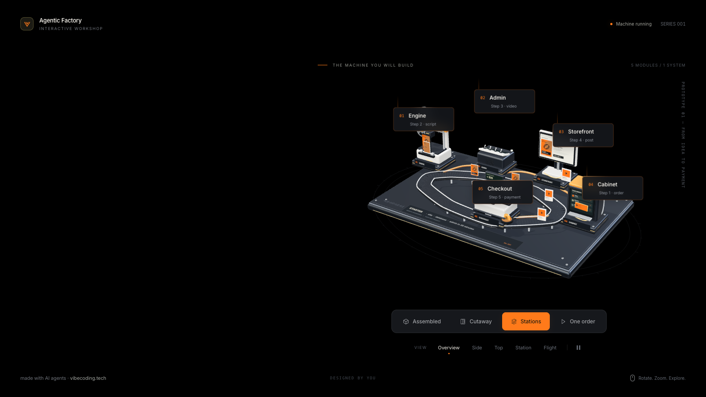

# Agentic Factory — Interactive 3D Machine

**A short-video factory that AI agents build, as one machine you can spin.**



A full-screen 3D machine in three.js: five stations on a metal plate, joined
by a conveyor belt and copper pipes. Orders run along the belt without a
break and change shape at every station:

**order → script → video → post → payment**

| #   | station        | what it does                                                                  |
| --- | -------------- | ----------------------------------------------------------------------------- |
| 1   | **Engine**     | a print head and film reels turn the order into a script and a vertical video |
| 2   | **Admin**      | a console with toggles and a live video queue                                 |
| 3   | **Storefront** | a monitor where the video lands on the product page                           |
| 4   | **Cabinet**    | the order window: new customer orders fly in                                  |
| 5   | **Checkout**   | a register that prints a receipt and drops a coin                             |

- Four modes: **Assembled**, **Cutaway** (the housings are cut open),
  **Stations** (the stations move apart with callouts) and **One order**
  (the camera follows a single order from the first card to the receipt)
- Five cameras: Overview, Side, Top, Station, Flight; a slow cinematic orbit
  when nobody touches it; hover a station to highlight it, click to fly to it
- Built for a landing page: above 900 px the machine stands in the right 58 %
  of the frame and leaves the left side dark for your headline; below 900 px
  it is centered
- **Embed mode** (`?embed=1`) and a small API: `window.__machine` plus
  `postMessage` both ways
- No models, no images: every part, and every screen inside the scene, is
  generated in code
- Next.js 16 (App Router, Turbopack), React 19, TypeScript, three.js 0.185
- No backend, no analytics, no cookies, no environment variables
- `prefers-reduced-motion` starts it paused; rendering stops while the frame
  is off screen

## Quick start

```bash
pnpm i
pnpm dev        # http://localhost:3000  (debug panels)
                # http://localhost:3000/?embed=1  (clean hero)
```

Other scripts: `pnpm build`, `pnpm start`, `pnpm lint`, `pnpm typecheck`,
`pnpm format`. Node 20.9 or newer. npm and yarn work too.

## Controls

| action            | how                                                      |
| ----------------- | -------------------------------------------------------- |
| rotate            | drag with the mouse or one finger                        |
| zoom              | mouse wheel or pinch                                     |
| inspect a station | hover it for a tooltip, click it to fly the camera there |
| switch the mode   | Assembled · Cutaway · Stations · One order               |
| camera            | Overview · Side · Top · Station · Flight                 |
| pause / resume    | the button at the end of the camera row                  |

In embed mode the wheel and the finger scroll your page instead of zooming
the scene (on touch screens rotation is off too), so the hero never traps the
scroll.

## Embed it as a hero

Deploy the template (Vercel, Netlify or any Node host) and put the embed
URL into an iframe behind your headline:

```html
<section style="position: relative; height: 720px; background: #000">
  <iframe
    src="https://your-machine.example.com/?embed=1"
    title="Agentic Factory"
    style="position: absolute; inset: 0; width: 100%; height: 100%; border: 0"
  ></iframe>
  <div style="position: relative; max-width: 40%; padding: 120px 48px; pointer-events: none">
    <h1 style="pointer-events: auto">Your headline</h1>
  </div>
</section>
```

`?embed=1` hides the panels, the heading and the hints before the first
paint; the scene, the hover highlight, the idle orbit and a small credit
line stay.

**Tip: a poster under the frame.** three.js takes a moment to start. Put a
screenshot of the embed view under the iframe, start the iframe at
`opacity: 0`, and fade it in when it sends `ready` (see the API below).

### API

Same origin (the iframe is on your domain), call it directly:

```js
const machine = document.querySelector('iframe').contentWindow.__machine
machine.setMode('cutaway') // 'assembled' | 'cutaway' | 'stations' | 'order'
machine.setCamera('flight') // 'overview' | 'side' | 'top' | 'station' | 'flight'
machine.focusStation('cashdesk') // 'engine' | 'admin' | 'storefront' | 'cabinet' | 'cashdesk'
machine.pause()
machine.play()
```

Every call returns `true`, or `false` for an unknown name. Button labels work
as names too (`'One order'`, `'Flight'`).

Any origin, use messages:

```js
const frame = document.querySelector('iframe')

// page → machine
frame.contentWindow.postMessage(
  { type: 'machine-control', action: 'focusStation', value: 'storefront' },
  'https://your-machine.example.com'
)

// machine → page
window.addEventListener('message', (event) => {
  if (event.source !== frame.contentWindow) return
  const data = event.data
  if (data?.type !== 'machine') return
  if (data.event === 'ready') frame.style.opacity = '1' // first real frame drawn
  if (data.event === 'station') console.log('clicked', data.id) // e.g. 'cashdesk'
})
```

`window.__machineDebug.getState()` returns the mode, camera, time, draw
calls and the screen position of every station, for automated checks.

## How it is built

```
app/layout.tsx         Inter via next/font, metadata, the ?embed=1 switch
app/page.tsx           renders <MachineScene />
app/globals.css        all overlay styles; `.embed .debug-ui` hides the panels
components/Scene.tsx   client component: the overlay markup; mounts the machine
lib/machine-scene.ts   initMachineScene(root, font): the whole machine and its API
public/preview.png     the screenshot above
```

`components/Scene.tsx` renders the overlay as plain markup and, once the web
font is ready, calls `initMachineScene(root, fontFamily)` in a `useEffect`.
The function builds the renderer into `#scene`, paints the in-scene screens
on canvases, wires the buttons, the API and the message bridge, starts the
frame loop, and returns a dispose function that removes every listener,
the API globals and all GPU resources.

Where to change things in `lib/machine-scene.ts`:

- **Stations**: the `definitions` table (id, name, flow step, output, position,
  tooltip line).
- **The one-order story**: the `journeySteps` table.
- **Text painted inside the scene** (the plate engraving, the queue screen,
  the product page, the orders screen, the receipt, the price): the
  `canvasTexture(...)` drawings and `drawVideo`, `drawQueue`, `drawCash`.
- **Colors**: `palette` and the `M` materials table in the scene, CSS
  variables at the top of `app/globals.css`.

## How it was made

Built by OpenAI Codex (GPT-6 Astra, reasoning xhigh) from a single prompt in
~22 minutes; ported to Next.js by Claude.

Codex produced one `index.html` file that loaded three.js from a CDN and had
its interface in Russian: the hero of a course landing page on
vibecoding.ru, where the five stations stood for five chapters of the course.
Before this template, that page got a few fixes: the brand palette (amber
`#FF7A1A` on black instead of the prompt's `#F5B700` on `#0E1013`), wheel
and touch that scroll the host page in embed mode, a clamp on the first
frame's time step (it went negative and threw errors for the first
half-second), a guard for zero-size iframes, and the `ready` message for a
poster. The port keeps the geometry, the numbers and the animation of that
version; it moves three.js to npm, splits the page into a React component
and a scene module with a proper dispose, translates every label and every
in-scene screen into English (prices in dollars), replaces the course
chapters in the callouts with each station's step in the order flow, and
changes the footer link to a credit line.

<details>
<summary>The prompt, translated from Russian</summary>

> Make a spectacular interactive 3D scene "The machine you will build in the
> course" as a single index.html file — the hero of the landing page for the
> "Agentic Engineering" course on vibecoding.ru. This is not a page with text
> but a live scene to embed into the landing page through an iframe.
>
> Technically: three.js (jsdelivr CDN, r160+), OrbitControls, WebGL, 60 frames
> per second on a laptop and smooth on a phone. The scene background is dark
> #0E1013 with no hard edges (so it blends into the page background), a light
> vignette; studio lighting with reflections on the metal, soft shadows. The
> accent is amber #F5B700, the second accent is warm white #F4F1EA. The font
> is Inter (Google Fonts CDN) or the system font. Everything in Russian. No
> external images or models: all geometry from primitives and procedural.
>
> What we show: a small factory of short videos that the student builds in
> the course, as one machine on a metal plate. The base plate is engraved
> "STARTER · site · database · admin in 35 minutes". On the plate there are
> five station-mechanisms connected by a belt and pipes, in order: 1 "Engine"
> — writes the script and assembles the video with voice and subtitles (a
> print head + a film reel, out of which a vertical video card slides); 2
> "Admin" — a console with toggle switches and a queue screen (the videos
> line up on the screen); 3 "Storefront" — a screen frame where the video
> takes its place on the product page; 4 "Cabinet" — an order window: client
> orders "fly" in here, glowing cards with a name; 5 "Checkout" — a cash
> register with a receipt sliding out and a falling coin. Orders run along
> the belt continuously: order (card) → script (sheet) → video (vertical card
> with running subtitles) → post (card with a channel icon) → receipt and
> coin. Everything is animated and synchronized with one common beat.
>
> Modes (switched by buttons and through the API): "Assembled"; "Cutaway" —
> the station housings are cut, the mechanics are visible; "By chapter" — the
> stations smoothly move apart, each with a callout with the name of the
> course chapter and the number of lessons: Engine — chapter 9, Admin —
> chapter 10, Storefront — chapter 11 (5 lessons), Cabinet — chapter 12,
> Checkout — chapter 13; "One order" — the camera follows one order from the
> cabinet to the receipt. Cameras: "Overview", "Side", "Top", "Station",
> "Flight" — smooth camera flights. Without user input — a slow cinematic
> orbit (idle); on hover over a station — a highlight and a caption; on
> click — the camera focuses on it.
>
> Layout for the landing page: when the window is wider than 900 px the
> machine stands in the right 58 % of the frame (the left part stays dark and
> empty — the page headline will go there, over the iframe); when it is
> narrower than 900 px — centered, compact, so that it fits entirely. The
> URL parameter `?embed=1` hides all built-in panels and buttons (only the
> scene, the hover highlight and the idle orbit remain); without it the
> panels are visible — for debugging.
>
> API for the page: `window.__machine = { setMode(name), focusStation(id),
setCamera(name), play(), pause() }` and `window.parent.postMessage({ type:
'machine', event: 'station', id }, '*')` on a click on a station; the
> station ids: engine, admin, storefront, cabinet, cashdesk. At the bottom of
> the scene, small: "vibecoding.ru".
>
> First plan, then write it and check that the file opens without errors in
> the console at 1440×720, 1920×1080 and 390×844.

</details>

Credit: made with AI agents · [vibecoding.tech](https://vibecoding.tech)

## License

Licensed for use in your own projects, personal or commercial, including
sites you build for clients. Redistributing or reselling the template itself,
as a template or starter, is not permitted.
