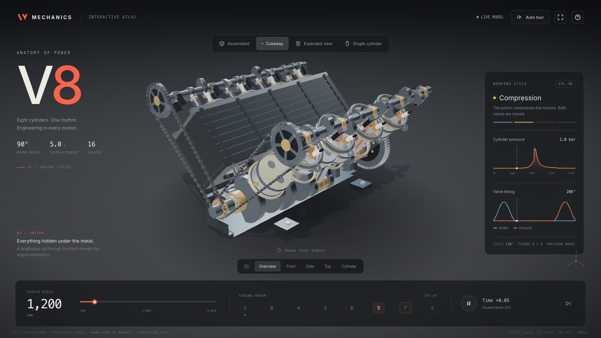

# V8 Engine — Interactive 3D

**Eight cylinders. One rhythm. A V8 you can take apart in the browser.**



A full-screen, fully procedural 3D V8 engine in three.js. Every part moves in
sync with the crankshaft angle: pistons and connecting rods, a cross-plane
crankshaft with counterweights, two camshafts with lobes and followers, valves
with springs that open on their real timing, spark plugs, a flywheel and a
toothed timing belt. Glass cylinder sleeves let you watch the pistons.

- Four views: **Assembled**, **Cutaway**, **Exploded view** (with callouts) and
  **Single cylinder** (the stroke is color-coded: intake, compression, power
  with a flash, exhaust)
- Five camera presets with smooth fly-overs, plus free orbit and zoom
- Engine speed from 700 to 6,000 rpm, a live firing order (1-8-4-3-6-5-7-2),
  live cylinder-pressure and valve-timing charts
- **Auto tour**: the camera orbits and switches views on its own
- No models, no textures, no images: geometry, materials and the contact
  shadow are generated in code
- Next.js 16 (App Router, Turbopack), React 19, TypeScript, three.js 0.169
- No backend, no analytics, no cookies, no environment variables
- Desktop and phone layouts; the panels fold into compact bars on a phone

## Quick start

```bash
pnpm i
pnpm dev        # http://localhost:3000
```

Other scripts: `pnpm build`, `pnpm start`, `pnpm lint`, `pnpm typecheck`,
`pnpm format`. Node 20.9 or newer. npm and yarn work too.

## Controls

| action                      | how                                          |
| --------------------------- | -------------------------------------------- |
| rotate                      | drag with the mouse or one finger            |
| zoom                        | mouse wheel or pinch                         |
| pan                         | right-drag or two fingers                    |
| switch the view             | the bar at the top: Assembled · Cutaway · …  |
| camera preset               | Overview · Front · Side · Top · Cylinder     |
| engine speed                | the slider in the bottom panel               |
| follow a cylinder           | click its number in the firing order         |
| stop on a stroke            | the colored bars under the stroke name       |
| pause / next firing / reset | `Space` / `→` / `R`                          |
| time scale                  | the "Time" button: ×0.01 · ×0.05 · ×0.2 · ×1 |

By default time runs 20× slower so the motion is readable. Pressure is an
illustrative model, not test data.

## How it is built

```
app/layout.tsx        Inter via next/font, metadata, viewport
app/page.tsx          renders <EngineScene />
app/globals.css       all overlay styles (panels, charts, labels, loader, phone layout)
components/Scene.tsx  client component: the overlay markup; mounts the engine on mount
lib/engine-scene.ts   initEngineScene(root): three.js scene, kinematics, charts, wiring
public/preview.png    the screenshot above
```

`components/Scene.tsx` renders the panels as plain markup and calls
`initEngineScene(root)` in a `useEffect`. The function builds the renderer
into `#viewport`, wires the buttons by id, starts the animation loop, and
returns a dispose function: it cancels the frame loop, removes every
listener, and frees all geometries, materials, textures and the WebGL
context. Unmounting the component leaves nothing behind.

Where to change things in `lib/engine-scene.ts`:

- **Geometry and materials**: the `materials` table and the build section
  (housing, crankshaft, banks, cylinders, timing drive).
- **Kinematics**: `R` (crank radius), `L` (rod length), `spacing`, the firing
  `order` and `pinOffsets`, `valveLift()` and `pressure()`.
- **Copy**: the `phaseNames`, `phaseDescriptions` and `modeCopy` tables, and
  the markup in `components/Scene.tsx`.
- **Colors**: CSS variables at the top of `app/globals.css` and
  `phaseColors` in the scene.

`window.__V8` exposes read-only diagnostics (state, camera, the physics
functions) for automated browser checks; delete that block if you do not
need it.

## How it was made

Built by OpenAI Codex (GPT-6 Astra, reasoning xhigh) from a single prompt in
~22 minutes; ported to Next.js by Claude.

Inspired by a viral post by Dilum Sanjaya (@DilumSanjaya):
https://x.com/DilumSanjaya/status/2096280244663775423 — an independent build
from a written description; no code or assets from the original.

Codex produced one `index.html` file that loaded three.js from a CDN and had
its interface in Russian. The port keeps the geometry, the numbers and the
animation as they were; it moves three.js to npm, splits the page into a
React component and a scene module with a proper dispose, translates every
label into English, switches the sans-serif font to Inter, puts a system
monospace font ahead of the generic one, and adds one footer credit line.

<details>
<summary>The prompt, translated from Russian</summary>

> Make a spectacular interactive 3D visualization of a V8 engine as a single
> index.html file.
>
> Technically: three.js (you can load it from the unpkg/jsdelivr CDN, version
> r160+), OrbitControls, WebGL, 60 frames per second on a laptop. The scene
> fills the whole screen (100vw × 100vh), the control panels are
> semi-transparent on top of the scene, not beside it; on a narrow vertical
> screen (a phone, 9:16) the scene is still full-screen, and the panels fold
> compactly to the bottom/top. A dark cinematic background (almost black with
> a light vignette), studio lighting with reflections on the metal, soft
> shadows; no depth of field needed.
>
> Geometry and mechanics (everything animated and synchronized with the
> crankshaft angle): a 90° V8 cylinder block, eight pistons with connecting
> rods, a crankshaft with counterweights (cross-plane), two camshafts with
> cams and followers, intake and exhaust valves with springs (the valves
> actually open according to their timing), spark plugs, a flywheel, timing
> gears/belt. Materials: dark metal for the block, light aluminum for the
> pistons, brass bushings, semi-transparent glass cylinders so the pistons
> can be seen.
>
> Modes (buttons over the scene): "Assembled", "Cutaway" (half of the block is
> cut away, everything inside is visible), "Exploded view" (the parts smoothly
> fly apart along the axes, with callout labels), "Single cylinder" (a
> close-up of one cylinder with its valves, and the stroke is highlighted in
> color: intake blue, compression yellow, power stroke red with a short
> flash, exhaust gray). Camera buttons: "Overview", "Front", "Side", "Top",
> "Cylinder" — smooth camera flights. An rpm slider from 700 to 6000 rpm with
> a large number; as the rpm rises, everything speeds up. A firing order
> diagram 1-8-4-3-6-5-7-2 with a running highlight of the current cylinder.
> Small live charts: valve timing and cylinder pressure over the crankshaft
> angle (SVG or canvas), updated in real time. An "Auto tour" button: the
> camera slowly orbits the engine on its own and switches modes every few
> seconds.
>
> Everything in Russian. No external images or models: all geometry from
> primitives and procedural. First plan, then write it and check that the
> file opens without errors in the console.

</details>

Credit: made with AI agents · [vibecoding.tech](https://vibecoding.tech)

## License

Licensed for use in your own projects, personal or commercial, including
sites you build for clients. Redistributing or reselling the template itself,
as a template or starter, is not permitted.
